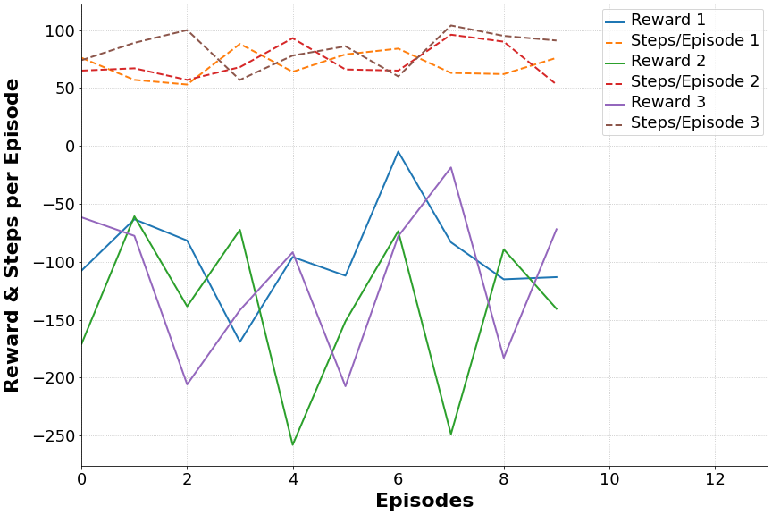

Date: 11/18/2020    
Author: Andrew Albright    
Email: andrew.albright1@louisiana.edu

# Discussion of Key Findings
Over the break and throughout the beginning of this semester, I have been able to lock down, what I think, is going to be the path for my research. That being: utilizing RL and potentially ES to evaluate the performance of a locomotive system with non-rigid components. Beyond just the evaluation, I would like to test the theory that using an RL algorithm to make modifications to an existing mechanical design can lead to better performance. Better performance being defined by, testing if the algorithm will come up with similar or better performing action charts (such as jumping height, running speed, ability to overcome obstacles), while reducing the amount of power needed to match the performance of a rigid system. 

> ***JV*** I think this is a fine path, as we've discussed. What do you think your initial direction will be? Is it to try to learn the control actions and leg configuration/parameters simultaneously? Learn them in a serial, but iterative manner? What do you think your metric for power consumption will be?

> ***AA*** Using the pogo-legged system, I would like to use TD3/PPO to try and learn the spring constant within a bounded limit, along with the control actions to try and create a system which can jump the highest. My goal in this is to see if there is a pattern in the direction the spring constant moves. In other words, is the adjusting of k in a converging direction or is it just random. Also is in consistent across several training episodes. 
> 
> This would lead into the use of the single leg system and our looking to see if the designs that are created are in the direction of better performance that we see in the designs we make ourselves. I am not thinking at first that we are going to task a RL based system with coming up with the "best" design. Rather, we will see if the designs it comes up with are closely related to the designs we see better performance 
> 
> So, I am thinking we create the pogo environment in such a way that there is a bounded k, and at the start of training, a k is selected within that bound. Across 3 training examples, maybe one in the middle, one higher in the bound and one lower. Every 5k or maybe 50k timesteps, the k value is selected to be adjusted by some value within the bounds so that it steps in a general direction. So in this instance the learning of k and controls would be in parallel and serial, but more in parallel. What do you think about this plan?

I have chosen PPO and DDPG RL algorithms to start with based on their popularity in this research area, the available resources/support they have, and input from my advisor. I have spent some time evaluating their performance on environments provided by OpenAI Gym to prepare for getting access to the single-legged system. See graph for the reward performance of the PPO algorithm using the hyperparameters specified by [Stable Baselines](https://github.com/DLR-RM/rl-baselines3-zoo/blob/master/hyperparams/ppo.yml) for optimal performance. Note this model is trained with significantly fewer timesteps than recommended, which was done for time saving more than anything. 

> ***JV*** How long did this training take?

> ***AA*** Not long, like 30 mins for 100k steps.

This data is an example of how I am looking to present data which is more related to the physical aspects of an environment. 

> ***JV*** What environment is this from?

> ***AA*** I believe it was from the LunarLanderContinuous one. I am going to be focusing on the pogo env now that I have it though.

Essentially this is more for practice for me and less for showing any particular advancement.

     
    <strong>Figure 1:Reward and Episode Length Data</strong>

> ***JV*** Please work with Gerald to get your plotting (including fonts) defaults set up to match our lab template and style.

> ***AA*** Will do. 

# Current Difficulties
## Theoretical/Analytical Difficulties
### DDPG and PPO algorithms
I have read the explanation papers for both of these algorithms. However, I am going to seek additional resources to fully understand every aspect of what goes into them. I feel relatively confident with DDPG, but I want to put more effort in so I can answer practically every question thrown at me related to these algorithms.

## Technical/Implementation Difficulties
### Stable Baselines Framework
The more I work with the code, the more proficient I become with how to utilize it. I am still learning and its taking time.

> ***JV*** Did you figure out how to use Tensorboard in Colab? How about saving the time response from a specific episode? 

> ***AA*** I did get it running in Colab. It is a little finicky, but it works. What do you mean time response? I haven't done it, obviously, but I'd like to know so I know what it.

# Team Activities
## Running/Jumping Robot Team:
The team is working diversly as of right now to prepare for a unison of work towards the semesters end. We are focused on getting the single-legged system up and running to prepare for data collection. We are also looking into getting that system, as well as a more complex system, up and running in ROS/Gazebo. Beyond getting current hardware/software up and running, we are also focusing on establishing an understanding of Stable Baselines platform to utilize what they offer to train and evaluate models on the single-legged system. We also have a new member as well who is working on becoming familiar with Python.

1. Eve - working on understanding some Python code so she can be of more assistant to the team. Will be moving towards helping Logan with the single-legged system shortly.

2. Jacob - Working getting the single-legged system as well as the hex system up and running in ROS/Gazebo

3. Logan - Working on getting the single-legged system's hardware up and running to become familiar with how to operate it. Will be beginning testing and evaluating performance of different leg structures soon.

> ***JV*** Did he make progress this week? Did he get the "backwards" servo problem figured out? Has he looked at the data collection piece yet? That seems next?

> ***AA*** I believe he has been. I know he's been working on getting the manual control up and running using a controller. I suggested this to him as to familiarize him with the way the programming of the motors works. That way we can write a script which will jump nicely.

1. Myself - working with Stable Baselines to become familiar with framework so we can get the single-legged system up and running quickly after it is finished.

> ***JV*** Have you tried running one of our custom environments? That will set you up for running the single-leg jumper once I finish it (soon, I promise). It's *just* a little different than running a stock Gym environment.

> ***AA*** I've run the pogo-stick env.

## Crawfish Peeling Team:
The team is working towards getting parts in house which are assembled, up and running. Beyond that, we are working towards looking to make some additional parts for the testing phase. 

We are also working towards getting the Cutting subsystem assembled.

1. Brennon - working with Dr. Vaughan getting the motors up and running. Working on making some additional parts for Clamping subsystem for testing. Printing parts for Cutting subsystem.    
    
2. Darcy - no longer a part of the team. Currently working on phasing out by getting his models up on the cloud.

3. Myself - Waiting for a replacement part to arrive after making a mistake on the order for the Cutting subsystem. Waiting for parts to be printed for the same system.
    
# Papers
## High Level Reviews
1. Rebala, G., Ravi, A., Churiwala, S., Rebala, G., Ravi, A., & Churiwala, S. (2019). Reinforcement Learning Algorithms. In An Introduction to Machine Learning (pp. 213–241). Springer International Publishing. https://doi.org/10.1007/978-3-030-15729-6_17
2. Andrychowicz, M., Raichuk, A., Stanczyk, P., Orsini, M., Girgin, S., Marinier, R., … Bachem, O. (2020, June 10). What Matters in On-Policy Reinforcement Learning? A Large-Scale Empirical Study. ArXiv. arXiv.
3. Bellegarda, G., & Nguyen, Q. (2020, November 13). Robust quadruped jumping via deep reinforcement learning. ArXiv. arXiv.
4. Domingos, P. (2020, November 30). Every model learned by gradient descent is approximately a kernel machine. ArXiv. arXiv.
5. Gleave, A., Dennis, M., Legg, S., Russell, S., & Leike, J. (2020, June 24). Quantifying differences in reward functions. ArXiv. arXiv.
6. Ha, S., Kim, J., & Yamane, K. (2018). Automated Deep Reinforcement Learning Environment for Hardware of a Modular Legged Robot. In 2018 15th International Conference on Ubiquitous Robots, UR 2018 (pp. 348–354). Institute of Electrical and Electronics Engineers Inc. https://doi.org/10.1109/URAI.2018.8442201
7. Lee, J., Hwangbo, J., Wellhausen, L., Koltun, V., & Hutter, M. (2020). Learning quadrupedal locomotion over challenging terrain. Science Robotics, 5(47). https://doi.org/10.1126/SCIROBOTICS.ABC5986
8. Rebala, G., Ravi, A., Churiwala, S., Rebala, G., Ravi, A., & Churiwala, S. (2019). Reinforcement Learning Algorithms. In An Introduction to Machine Learning (pp. 213–241). Springer International Publishing. https://doi.org/10.1007/978-3-030-15729-6_17
9. Villarreal-Cervantes, M. G., Cruz-Villar, C. A., Alvarez-Gallegos, J., & Portilla-Flores, E. A. (2013). Robust structure-control design approach for mechatronic systems. IEEE/ASME Transactions on Mechatronics, 18(5), 1592–1601. https://doi.org/10.1109/TMECH.2012.2208196
10. Zamora, I., Lopez, N. G., Vilches, V. M., & Cordero, A. H. (2016). Extending the OpenAI Gym for robotics: a toolkit for reinforcement learning using ROS and Gazebo. Retrieved from http://arxiv.org/abs/1608.05742
11. Lillicrap, T. P., Hunt, J. J., Pritzel, A., Heess, N., Erez, T., Tassa, Y., … Wierstra, D. (2016). Continuous control with deep reinforcement learning. In 4th International Conference on Learning Representations, ICLR 2016 - Conference Track Proceedings. International Conference on Learning Representations, ICLR.
12. Schulman, J., Wolski, F., Dhariwal, P., Radford, A., & Klimov, O. (2017, July 19). Proximal policy optimization algorithms. ArXiv. arXiv.
13. Dwiel, Z., Candadai, M., & Phielipp, M. (2019). On Training Flexible Robots using Deep Reinforcement Learning. In IEEE International Conference on Intelligent Robots and Systems (pp. 4666–4671). Institute of Electrical and Electronics Engineers Inc. https://doi.org/10.1109/IROS40897.2019.8968516
14. Laversanne-Finot, A., Péré, A., & Oudeyer, P. Y. (2021). Intrinsically Motivated Exploration of Learned Goal Spaces. Frontiers in Neurorobotics, 14. https://doi.org/10.3389/fnbot.2020.555271
15. Bhagat, S., Banerjee, H., Tse, Z. T. H., & Ren, H. (2019). Deep reinforcement learning for soft, flexible robots: Brief review with impending challenges. Robotics. MDPI AG. https://doi.org/10.3390/robotics8010004
16. Polydoros, A. S., & Nalpantidis, L. (2017). Survey of Model-Based Reinforcement Learning: Applications on Robotics. Journal of Intelligent and Robotic Systems: Theory and Applications, 86(2), 153–173. https://doi.org/10.1007/s10846-017-0468-y
17. Conti, E., Madhavan, V., Such, F. P., Lehman, J., Stanley, K. O., & Clune, J. (2017, December 18). Improving exploration in evolution strategies for deep reinforcement learning via a population of novelty-seeking agents. ArXiv. arXiv.
18. Singh, A., Liu, H., Zhou, G., Yu, A., Rhinehart, N., & Levine, S. (2020, November 19). Parrot: Data-driven behavioral priors for reinforcement learning. ArXiv. arXiv.
19. Zahavy, T., Xu, Z., Veeriah, V., Hessel, M., Oh, J., Hasselt, H.V., Silver, D., & Singh, S. (2020). A Self-Tuning Actor-Critic Algorithm. arXiv: Machine Learning.

> ***JV*** Good job.

## Detailed Reviews

1. Zamora, I., Lopez, N. G., Vilches, V. M., & Cordero, A. H. (2016). Extending the OpenAI Gym for robotics: a toolkit for reinforcement learning using ROS and Gazebo. Retrieved from http://arxiv.org/abs/1608.05742
2. Lillicrap, T. P., Hunt, J. J., Pritzel, A., Heess, N., Erez, T., Tassa, Y., … Wierstra, D. (2016). Continuous control with deep reinforcement learning. In 4th International Conference on Learning Representations, ICLR 2016 - Conference Track Proceedings. International Conference on Learning Representations, ICLR.
3. Schulman, J., Wolski, F., Dhariwal, P., Radford, A., & Klimov, O. (2017, July 19). Proximal policy optimization algorithms. ArXiv. arXiv.
4. Dwiel, Z., Candadai, M., & Phielipp, M. (2019). On Training Flexible Robots using Deep Reinforcement Learning. In IEEE International Conference on Intelligent Robots and Systems (pp. 4666–4671). Institute of Electrical and Electronics Engineers Inc. https://doi.org/10.1109/IROS40897.2019.8968516
5. Bhagat, S., Banerjee, H., Tse, Z. T. H., & Ren, H. (2019). Deep reinforcement learning for soft, flexible robots: Brief review with impending challenges. Robotics. MDPI AG. https://doi.org/10.3390/robotics8010004
6. Zahavy, T., Xu, Z., Veeriah, V., Hessel, M., Oh, J., Hasselt, H.V., Silver, D., & Singh, S. (2020). A Self-Tuning Actor-Critic Algorithm. arXiv: Machine Learning.

I read these papers in full but have not found (taken) the time to write out descriptions here. Many of these I sent to you and we have had discussions about them if you recall.

> ***JV*** Okay. It is helpful to keep notes like those I request in whatever software you are using to manage your bibliography. It's really helpful in that you won't have to re-read all of the papers when you start writing the background sections of your papers or thesis. You can (mostly) work from these notes. In other words, these descriptions are not just for me. They are intended to help you guys too.

### Title

### Summary

### Main Contribution to Relationship Field

### Relevance to Current Research

## Future Reading
### Types of papers I plan to read in the next two weeks:
* I will be looking to find more papers which demonstrate RL or ES being used to
  *  develop a control strategy for legged-locomotion system
  *  ... for a non-rigid system
  *  modify the physical parameters of a system (preferably a locomotive one)
  
> ***JV*** Beyond RL and ES, you might look into "data-driven control".

> ***AA*** I will look into it. I think you've sent some resources lately, I look through them.

### What I am aiming to achieve from reading these papers: 
* I am looking to further my understanding of the how to's of utilizing RL and ES. Beyond that I am looking to expand my understanding of the current status of this research.

### Why I am looking to achieve that:
* I would like to see how others might have tried achieving something similar to what I am doing.

# Plan for the Next Two Weeks 

## Ideas Looking Forward

### Crawfish Peeler Project
I am thinking the design for the Extraction subsystem will need modifying. I think we can utilize much, if not all, of the hardware we have now to accomplish the goal. We are still anticipating testing the current design. 

### Robotics Research
I think we have discussed all of the ideas I have at the moment. Right now, I am trying to accomplish some tasks which will lead to testing those ideas.

## Current Next Steps

### Crawfish Peeler Project
Get the parts we have assembled and operating.

### Robotics Research
Continue finding work completed in the area of utilizing RL for robotic physical design combined with controller design. 

Become familiar with parsing and plotting the physical parameters of an OpenAI gym environment. Utilize Tensorboard to keep track of the data in a live setting.

## Expectations for Next Report (12/02/2020)
1. Accomplish training a model on a Gym env and plotting its physical performance along with the standard reward.
   * this can be one from OpenAI or one provided from somewhere else. Once I get this done on one, I imagine it will be easily doable for others.
2. Get Tensorboard up and running in a Colab setting
3. Get the team on board with a scope for finishing up the papers sent by Dr. Vaughan

## Current Schedule Outlook
* 02/12 - Full Team Meeting
* 02/15 - Crawfish Team Meeting
* 02/17 - Running/Jumping Robot Team Meeting
* 02/19 - Full Team Meeting
* 02/19 - Research Presentation
* 02/22 - Crawfish Team Meeting
* 02/24 - Running/Jumping Robot Team Meeting
* 02/24 - Running/Jumping Robot Team Report Due
* 02/24 - Crawfish Team Report Due
* 02/26 - Full Team Meeting
* 03/01 - Crawfish Peeling Meeting
* 03/03 - Running/Jumping Robot Team Meeting
* 03/03 - Report Due

# Long-term planning

## Upcoming Paper Deadlines
I would like to have a discussion and pick out some paper topics we can set so we can begin building a path towards getting them written. We have the two that you sent that we can bring in and look to finish/clean-up and submit.

> ***JV*** Take a look at the conferences posted in the Upcoming Conferences page on the wiki. Click through the ones with deadlines this spring. They will all have a a listing of the conference thrust areas and topics areas that you can submit to. Pick out a few that you think will work and let's discuss.

> ***AA*** Been discussed.

I know there are papers that we can write as we go through the processes of getting the legged robots up and running and I want to get the undergrads on board with that. I want to get each undergrad started on a paper by next report. I think that is doable.

> ***JV*** Yes. Me too.

## Administrative Deadlines
### Running/Jumping Robots Team
* Deadlines will be linked to papers. I plan to get the team on board with a paper topic per undergrad by next meeting.

### Crawfish Peeler Team
* No immediate deadlines.

### Research
[MS Graduation Process](http://crawlab.org/wiki/index.php?title=MS_Graduation_Process)