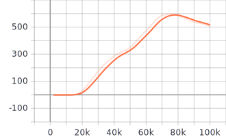
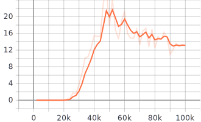
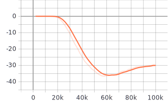

Date: 11/18/2020    
Author: Andrew Albright    
Email: andrew.albright1@louisiana.edu

# Discussion of Key Findings
Since the last report we have locked down our initial direction to take for getting results for writing papers and "beginning" the research. That being:

1.  Utilizing the pogo env to challenge the idea that an RL algorithm can come up with unique control strategies for power consumption conservation in flexible systems.
2.  Utilizing the pogo env to test the idea that RL algorithms can be given physical parameters such as spring constant to learn, optimizing them for the control input they are tested with.

That said, the pogo env has been developed for both initial directions and the one for power consumption has been tested using Stable Baselines. See below, figures which are taken from Tensorboard tracking during training using the TD3 algorithm. Note that these figures, while important during training, are not the data we are looking to collect yet. That is still to come.  

 
<strong>Reward Mean | Critic Loss | Actor Loss  vs. Timesteps</strong>

> ***AA*** I haven't found time to ask Gerald about getting these plots in line with the lab format. I will be doing that once I collect data outside of training data. I will be using tensorboard to track training since it so easy to use.

# Current Difficulties
## Theoretical/Analytical Difficulties
Now that I have the environment to work with and an immediate path to follow I will begin to see more relevant difficulties in terms of research.
### Writing Papers, Citing Sources
I have been thinking about citing sources and have a list of sources that are directly relevant to the work. However the list is not that long and I am sure there are sources that I should be putting in that I am not. When I begin writing, starting with the Fat Outline, I am sure there will be points where you will see an obvious statement that needs a source.

## Technical/Implementation Difficulties
### Stable Baselines Framework
Related to the last report, I haven't used Tensorboard for logging information during evaluation, just trining. I will need to look into this more.

# Team Activities
## Running/Jumping Robot Team:
We are still working in a less unified way right now, each focusing on their own tasks. The single leg system had made progress with the code for manual control. We are hoping to finish that this week and begin work on evaluating the performance of some flexible and rigid leg designs. The hardware for the hex system is still being worked on, we have found a version of Ubuntu to run on the Pi board and are uploading that today.

1. Eve - continuing work on understanding python. Has begun working with Logan understanding the code written for the single legged system. Will be doing some data processing in the near future on some data collected using the pogo environment.

2. Jacob - Working getting Ubuntu on the Pi board. Going to work on getting the rest of the hardware up and running. 

3. Logan - Working on getting the code written for manual operation of the single legged system. Going to be working on testing an array of flexible and rigid leg designs and collecting data. 

4. Myself - working on the pogo environments utilizing Stable Baseline's TD3 algorithm to train.

## Crawfish Peeling Team:
The parts we were waiting for are in house and have been cut to length. We are in the process of finding and selecting a blade for the cutter which will define some other part parameters which will need fabricating. We are also in the process of updating the de-header subsystem to keep the t-slotted framing parallel. This update will require fabrication as well. 

1. Brennon - Printed parts needed for Cutting subsystem. Redesigned hardware for keeping the de-header subsystem parts parallel. Working with Dr. Vaughan getting the motors up and running. Working on making some additional parts for Clamping subsystem for testing. Working on blade selection.
    
2. Darcy - Has uploaded his model to the cloud. Will not be included from here on out.

3. Myself - Ordered replacement parts, cut all parts to length. Evaluating blade dimensions to make changes to the Cutting subsystem for final fabrication.
    
# Papers
## High Level Reviews
1. Puiutta, E., & Veith, E. M. S. P. (2020). Explainable Reinforcement Learning: A Survey. In Lecture Notes in Computer Science (including subseries Lecture Notes in Artificial Intelligence and Lecture Notes in Bioinformatics) (Vol. 12279 LNCS, pp. 77–95). Springer. https://doi.org/10.1007/978-3-030-57321-8_5
2. Yu, T., Kumar, A., Rafailov, R., Rajeswaran, A., Levine, S., & Finn, C. (2021). COMBO: Conservative Offline Model-Based Policy Optimization. Retrieved from http://arxiv.org/abs/2102.08363
3. Gupta, A., Savarese, S., Ganguli, S., & Fei-Fei, L. (2021). Embodied Intelligence via Learning and Evolution. Retrieved from http://arxiv.org/abs/2102.02202
4. file:///C:/Users/andre/AppData/Local/Mendeley%20Ltd/Mendeley%20Desktop/Downloaded/37b89387cc2360780d9c4ef71e6918e2842a3b25.html
5. Kamthe, S., & Deisenroth, M. P. (2018). Data-efficient reinforcement learning with probabilistic model predictive control. In International Conference on Artificial Intelligence and Statistics, AISTATS 2018 (pp. 1701–1710). PMLR.
6. Ouyang, Y., He, W., & Li, X. (2017). Reinforcement learning control of a singlelink flexible robotic manipulator. IET Control Theory and Applications, 11(9), 1426–1433. https://doi.org/10.1049/iet-cta.2016.1540
7. Rosolia, U., & Borrelli, F. (2018). Learning model predictive control for iterative tasks. A data-driven control framework. IEEE Transactions on Automatic Control, 63(7), 1883–1896. https://doi.org/10.1109/TAC.2017.2753460
8. Raffin, A., & Stulp, F. (2020, May 12). Generalized State-Dependent Exploration for Deep Reinforcement Learning in Robotics. ArXiv. arXiv.
9. Silver, D., Lever, G., Heess, N., Degris, T., Wierstra, D., & Riedmiller, M. (2014). Deterministic policy gradient algorithms. In 31st International Conference on Machine Learning, ICML 2014 (Vol. 1, pp. 605–619). International Machine Learning Society (IMLS).
10. Gay, G. R., Salomoni, P., & Mirri, S. (2007). E-Learning. In Encyclopedia of Internet Technologies and Applications (pp. 179–184). IGI Global. https://doi.org/10.4018/978-1-59140-993-9.ch026
11. Mnih, V., Kavukcuoglu, K., Silver, D., Graves, A., Antonoglou, I., Wierstra, D., & Riedmiller, M. (2013). Playing Atari with Deep Reinforcement Learning. Retrieved from http://arxiv.org/abs/1312.5602
12. Van Hasselt, H., Guez, A., & Silver, D. (2016). Deep reinforcement learning with double Q-Learning. In 30th AAAI Conference on Artificial Intelligence, AAAI 2016 (pp. 2094–2100). AAAI press.
13. Bhagat, S., Banerjee, H., Tse, Z. T. H., & Ren, H. (2019). Deep reinforcement learning for soft, flexible robots: Brief review with impending challenges. Robotics. MDPI AG. https://doi.org/10.3390/robotics8010004
14. Lillicrap, T. P., Hunt, J. J., Pritzel, A., Heess, N., Erez, T., Tassa, Y., … Wierstra, D. (2016). Continuous control with deep reinforcement learning. In 4th International Conference on Learning Representations, ICLR 2016 - Conference Track Proceedings. International Conference on Learning Representations, ICLR.
15. Hansen, N., Sun, Y., Abbeel, P., Efros, A. A., Pinto, L., & Wang, X. (2020, July 8). Self-Supervised Policy Adaptation during Deployment. ArXiv. arXiv.
16. Real, F., Batou, A., Ritto, T., & Desceliers, C. (2019). Stochastic modeling for hysteretic bit–rock interaction of a drill string under torsional vibrations. Journal of Vibration and Control, 107754631982824. https://doi.org/10.1177/ToBeAssigned
17. Fujimoto, S., Van Hoof, H., & Meger, D. (2018). Addressing Function Approximation Error in Actor-Critic Methods. In 35th International Conference on Machine Learning, ICML 2018 (Vol. 4, pp. 2587–2601). International Machine Learning Society (IMLS).

## Detailed Reviews

1. Silver, D., Lever, G., Heess, N., Degris, T., Wierstra, D., & Riedmiller, M. (2014). Deterministic policy gradient algorithms. In 31st International Conference on Machine Learning, ICML 2014 (Vol. 1, pp. 605–619). International Machine Learning Society (IMLS).
2. Gay, G. R., Salomoni, P., & Mirri, S. (2007). E-Learning. In Encyclopedia of Internet Technologies and Applications (pp. 179–184). IGI Global. https://doi.org/10.4018/978-1-59140-993-9.ch026
3. Mnih, V., Kavukcuoglu, K., Silver, D., Graves, A., Antonoglou, I., Wierstra, D., & Riedmiller, M. (2013). Playing Atari with Deep Reinforcement Learning. Retrieved from http://arxiv.org/abs/1312.5602
4. Van Hasselt, H., Guez, A., & Silver, D. (2016). Deep reinforcement learning with double Q-Learning. In 30th AAAI Conference on Artificial Intelligence, AAAI 2016 (pp. 2094–2100). AAAI press.
5. Lillicrap, T. P., Hunt, J. J., Pritzel, A., Heess, N., Erez, T., Tassa, Y., … Wierstra, D. (2016). Continuous control with deep reinforcement learning. In 4th International Conference on Learning Representations, ICLR 2016 - Conference Track Proceedings. International Conference on Learning Representations, ICLR.
6. Mnih, V., Kavukcuoglu, K., Silver, D., Graves, A., Antonoglou, I., Wierstra, D., & Riedmiller, M. (2013). Playing Atari with Deep Reinforcement Learning. Retrieved from http://arxiv.org/abs/1312.5602

I am not leaving description on these papers as they are all related to my learning more deeply, what TD3 is. I gave a presentation on the last week, and have 60 ish slides describing it for future reference.

### Bhagat, S., Banerjee, H., Tse, Z. T. H., & Ren, H. (2019). Deep reinforcement learning for soft, flexible robots: Brief review with impending challenges. Robotics. MDPI AG. https://doi.org/10.3390/robotics8010004

### Summary
Highlights some of the impending challenges as of 2019 of using RL with flexible robotics systems. Covers an array of different system types, like biomedical, mobile, edible and origami. Looks at several different algorithms used in these different type of robots. Looks at some of the struggles of imitation learning being it is the next step of training robots.

### Main Contribution to Relationship Field
Looks at some of the current and forseeable struggles that will exist with RL and flexible systems. More so though, the struggles of imitation learning. Also, this paper is a massive compilation of references many of which I have highlighted and will be in my next report.

### Relevance to Current Research
I read through this to see if I could find some relevant information related to the work we'll be doing. There wasn't much honestly. It was a good bit of info on imitation learning which we are not using.

## Future Reading
### Types of papers I plan to read in the next two weeks:
* I will be looking to find more papers which demonstrate RL or ES being used to
  *  develop a control strategy for legged-locomotion system
  *  ... for a non-rigid system
  *  modify the physical parameters of a system (preferably a locomotive one)
* Look into papers related to data-driven control

### What I am aiming to achieve from reading these papers: 
* I am looking to further my understanding of the how to's of utilizing RL and ES. Beyond that I am looking to expand my understanding of the current status of this research.

### Why I am looking to achieve that:
* I would like to see how others might have tried achieving something similar to what I am doing.

# Plan for the Next Two Weeks 
* Create scripts for training and collecting data on the following:
  * Power conservative pogo environment
  * Mechanical design pogo environment
* Process the data with the help of Eve
* Fat Outline for both papers we are writing
* Extended Abstract written for Mechanical Design paper
* Gantt Chart created for legged locomotive team

## Ideas Looking Forward

### Crawfish Peeler Project
I am still thinking the design for the Extraction subsystem will need modifying. I think we can utilize much, if not all, of the hardware we have now to accomplish the goal. We are still anticipating testing the current design.

### Robotics Research
I think we have discussed all of the ideas I have at the moment. Right now, I am trying to accomplish some tasks which will lead to testing those ideas.

## Current Next Steps

### Crawfish Peeler Project
Get the parts we have assembled and operating. Get the blade dimensions locked down so we can cut the final parts.

### Robotics Research
Continue finding work completed in the area of utilizing RL for robotic physical design combined with controller design. 

Become familiar with parsing and plotting the physical parameters of an OpenAI gym environment. Utilize Tensorboard to keep track of the data in a live setting.

## Expectations for Next Report (12/02/2020)
1. Create scripts for training and collecting data on the following:
   - Power conservative pogo environment
   -  Mechanical design pogo environment
2. Process the data with the help of Eve
3.  Fat Outline for both papers we are writing
4.  Extended Abstract written for Mechanical Design paper
5.  Gantt Chart created for legged locomotive team

## Current Schedule Outlook
* 03/05 - Full Team Meeting
* 03/08 - Crawfish Team Meeting
* 03/09 - IMECE Extended Abstract Due @ 11:59pm ET
* 03/10 - MCHE 508 Exam 1
* 03/10 - Running/Jumping Robot Team Meeting
* 03/10 - Crawfish Team Report Due
* 03/10 - Running/Jumping Robot Team Report Due
* 03/12 - Full Team Meeting
* 03/15 - Crawfish Team Meeting
* 03/17 - Report Due

# Long-term planning

## Upcoming Paper Deadlines
* 03/09 - IMECE Extended Abstract Due
  * Paper on mechanical design
* 04/02 - MECC Full Paper Due
  * Paper on power consevation
* 04/23 - IMECE Full Paper Due
  * Paper on mechanical design

## Administrative Deadlines
### Running/Jumping Robots Team
See paper deadlines. Currently the team beyond me is not going to be holding up these deadlines. However, if we want to get them re-writing one of the papers you sent that Yasmine worked on, that is an option.

### Crawfish Peeler Team
See paper deadlines.

### Research
[MS Graduation Process](http://crawlab.org/wiki/index.php?title=MS_Graduation_Process)