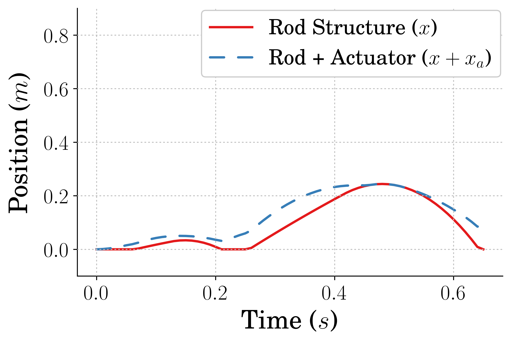
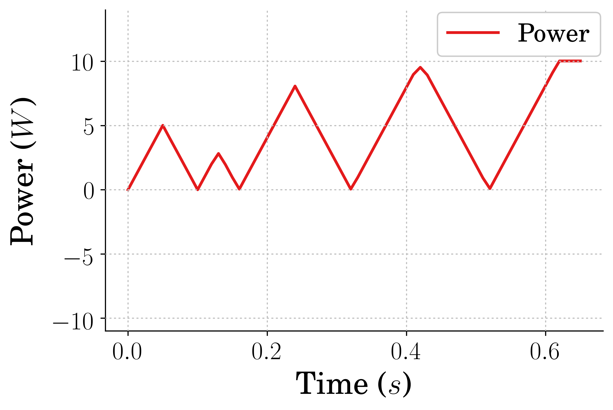
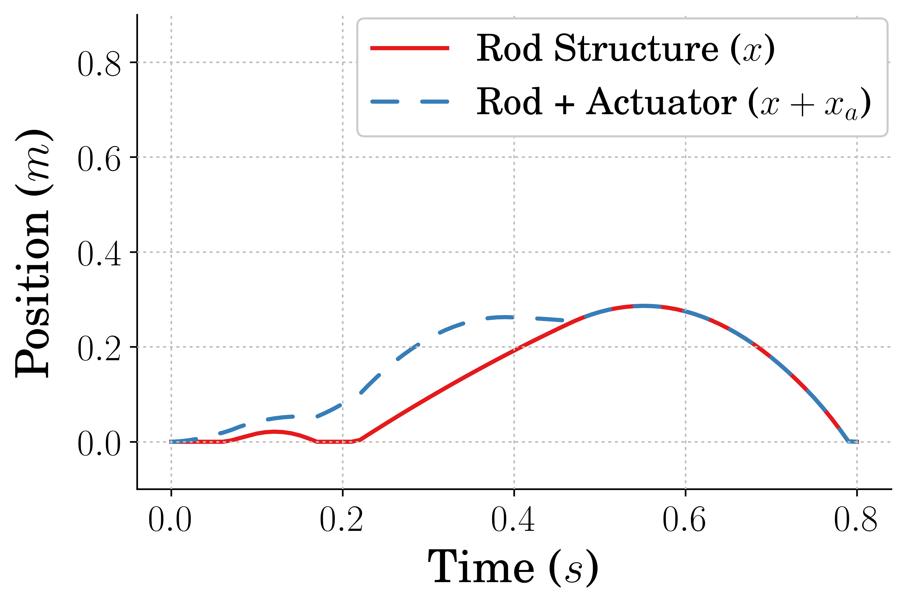
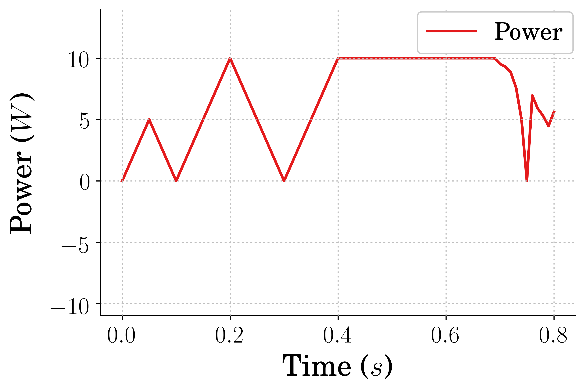
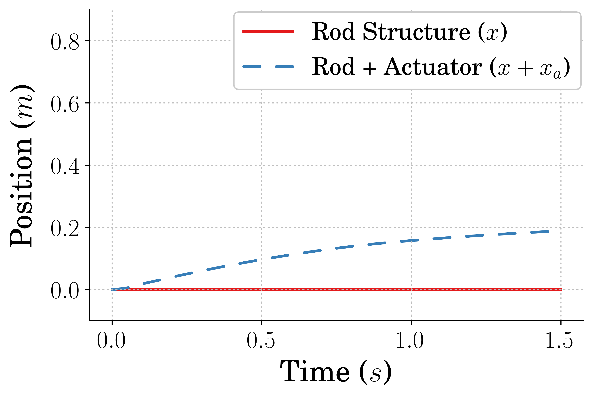
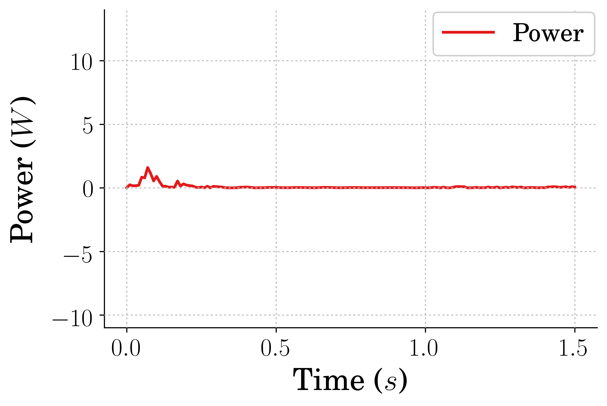

Date: 03/17/2021    
Author: Andrew Albright    
Email: andrew.albright1@louisiana.edu

# Discussion of Key Findings
We've run some training using the Pogo-stick environment and seen pretty good results so far. We are starting with the `pogo_stick_jumping_contAction.py` to gather data on wether or not RL can come up with controllers which optimize jump height while considering power consumption. Training has been completed weighting power consumption and jump height, what I thought was equally, and things need further tuning. 

The `pogo_stick_jumping_springAction.py` has been utilized to see how training runs, and after some modifications to the simulation time and accuracy, it seems more feasible to train in a reasonable time. This will be looked into further in the future.

See below for Evaluation results using an agent rewarded with only jumping height given 5 seconds to maximize the height.

 
<strong>Jump Height and Power Usage vs Time</strong>

See below for Evaluation results using an agent rewarded with only jumping height given only one jump to maximize height. Note the height jump achieved is higher than the last. However, the power usage is increased.

 
<strong>Jump Height and Power Usage vs Time</strong>

See below for Evaluation results using an agent rewarded for jumping high and punished for using power. This agent was also trained normalizing the reward. I chose 1.5 meters as the max height for normalizing the reward received from jumping high. I am thinking this was too high, as the agent clearly chooses to optimize using no power. This leads me to believe too that my tensorboard logger isn't working right. Not sure though yet.

 
<strong>Jump Height and Power Usage vs Time</strong>

# Current Difficulties
## Theoretical/Analytical Difficulties
I am currently working on getting the reward tuned for the `pogo_stick_jumping_contAction.py` environment. I will be changing the way the difference in weights for jump height and power usage and re-training. 

## Technical/Implementation Difficulties
### Stable Baselines Framework
Working through writing more in depth code is causing me to spend more time figuring out things not really related to the things we want to test. This is to be expected I suppose, but I am learning non-the-less which helps me get through it. 

# Team Activities
## Running/Jumping Robot Team:
Progress has been made these past two weeks. Each team member has picked up the pace as they are beginning to see results. I can see specifically Logan and Jacob are spending more time in the lab working on things which they are having fun seeing results on. I want to get Eve to this point soon as well.

1. Eve - started looking through some of the code we have written related to the Pogostick environment training, evaluating and plotting. I have tasked her with understanding the plotting aspect of things and will be working towards getting her to understand the evaluating aspect, then training. This way she will be able to do these things while the work she cannot do moves forward.

2. Jacob - Working on getting the Hex hardware moving through manual input. He got the robot spun up and running in ROS and is looking to make the transition to hardware. He is also working on a test plan for gathering data on jump and velocity performance. 

3. Logan - Working on the single-legged systems data gathering parts. He is becoming more familiar with the way the code controls the system and how the test bench collects data. He is also working on getting a poster ready for UL's E&T Week.  

4. Myself - working on the training and evaluating agents for the Pogostick environment. Current main focus is on the `pogo_stick_jumping_contAction.py` environment, but I will be shifting some of that focus towards the `pogo_stick_jumping_springAction.py` soon. I am also working on a poster for UL's E&T Week, the paper for IMECE and a paper for MECC.

## Crawfish Peeling Team:
We just water jetted the parts we needed to complete the Cutting subsystem and the new cams for the Clamping subsystem. With this done, the assembly can be completed and testing can begin. 

1. Brennon - Redesigned cams for Clamping subsystem. Wrote abstract for IMECE paper. Working on IMECE Paper. Helped get the parts cut that we needed. Working to set up a time to get the motors spun up.

2. Myself - Assembled parts of the Cutting subsystem that we had at the time. Redesigned the Cutting subsystem. Helped cut the material needed. Helped write the abstract. Helping write the paper. 
    
# Papers
## High Level Reviews
[1] D. J. Hejna, P. Abbeel, and L. Pinto, “Task-Agnostic Morphology Evolution,” 2021, [Online]. Available: http://arxiv.org/abs/2102.13100.

[2] M. H. David Hoeller, “Learning a State Representation and Navigation in Cluttered and Dynamic Environments,” no. CoRL, pp. 1–8, 2020.

[3] G. H. Liu and E. A. Theodorou, “Deep learning theory review: An optimal control and dynamical systems perspective,” arXiv, 2019.

[4] N. E. Toklu, P. Liskowski, and R. K. Srivastava, “Clipup: A simple and powerful optimizer for distribution-based policy evolution,” Lect. Notes Comput. Sci. (including Subser. Lect. Notes Artif. Intell. Lect. Notes Bioinformatics), vol. 12270 LNCS, pp. 515–527, 2020, doi: 10.1007/978-3-030-58115-2_36.

[5] G. Bellegarda and Q. Nguyen, “Robust High-speed Running for Quadruped Robots via Deep Reinforcement Learning,” 2021, [Online]. Available: http://arxiv.org/abs/2103.06484.

I have been lazy with reading these past two weeks. I will do better.

## Detailed Reviews
n/a

### Cite
### Summary
### Main Contribution to Relationship Field
### Relevance to Current Research

## Future Reading
### Types of papers I plan to read in the next two weeks:
* I will be looking to find more papers which demonstrate RL or ES being used to
  *  develop a control strategy for legged-locomotion system
  *  ... for a non-rigid system
  *  modify the physical parameters of a system (preferably a locomotive one)
* Look into papers related to data-driven control
* sim-to-real papers
* Papers which discuss reward function tuning
* Look into reading Papers which are generally just interesting and not ones that are directly related to my research

### What I am aiming to achieve from reading these papers: 
* I want to read papers which directly relate to the current issues I am having (reward tuning), papers which highlight the overall scope of my work (RL for flexible systems and changing design parameters), papers which are going to be filling me in on some future processes (sim-to-real), and papers which help keep me sane (things I find interesting).

### Why I am looking to achieve that:
* To help solve the issues I am having, to help keep me guided, to help keep me from running into a wall when a new task comes my way, to help keep me sane.

# Plan for the Next Two Weeks 
* Jump height and Power usage data for the pogo system finalized
* Agents trained to solve optimal K for the pogo env optimal input from Dr. Vaughans paper
  * Data on this (probably initial data)
* Poster submitted for UL's E&T Week
* Paper for MECC mostly finished
  * Possibly some final editing needs finishing at that point
* Paper for IMECE more finished
  * Still will be three weeks out so it is not **as** rushed

## Ideas Looking Forward

### Crawfish Peeler Project
I am still thinking the design for the Extraction subsystem will need modifying. I think we can utilize much, if not all, of the hardware we have now to accomplish the goal. We are still anticipating testing the current design.

### Robotics Research
I want to test the agents we get from the `pogo_stick_jumping_contAction.py` environment on systems with different spring constants to see how well the agent performs given a different environment. Then I want to train an agent on environment where the spring k is varied during trainging and see how it compares to the other agent. I will need to get a better reward function defined first though.

## Current Next Steps

### Crawfish Peeler Project
Get the parts we have assembled and operating. Get the blade and testing material ordered. 

### Robotics Research
Figure out the Reward function issues for the `pogo_stick_jumping_contAction.py`. Train agents and evaluate performance on the `pogo_stick_jumping_springAction.py` environment. Finish poster for E&T Week. Write MECC Paper. 

## Expectations for Next Report (12/02/2020)
1. Jump height and Power usage data for the pogo system finalized
2. Agents trained to solve optimal K for the pogo env optimal input from Dr. Vaughans paper
  * Data on this (probably initial data)
3. Poster submitted for UL's E&T Week
4. Paper for MECC mostly finished
  * Possibly some final editing needs finishing at that point
5. Paper for IMECE more finished

## Current Schedule Outlook
* 03/19 - Full Team Meeting
* 03/22 - Crawfish Team Meeting
* 03/24 - Running/Jumping Robot Team Meeting
* 03/24 - Crawfish Team Report Due
* 03/24 - Running/Jumping Robot Team Report Due
* 03/26 - Full Team Meeting
* 03/26 - Team Meeting Crawfish Presentation
* 03/29 - Crawfish Team Meeting
* 03/17 - Report Due

# Long-term planning

## Upcoming Paper Deadlines
* 04/02 - MECC Full Paper Due
  * Paper on power consevation
* 04/23 - IMECE Full Paper Due
  * Paper on mechanical design
* 09/14 - ICRA Full Paper Due
  * Paper topic not determined

## Administrative Deadlines
### Running/Jumping Robots Team
See paper deadlines. Currently the team beyond me is not going to be holding up these deadlines. However, if we want to get them re-writing one of the papers you sent that Yasmine worked on, that is an option.

### Crawfish Peeler Team
See paper deadlines.

### Research
[MS Graduation Process](http://crawlab.org/wiki/index.php?title=MS_Graduation_Process)