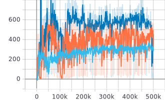
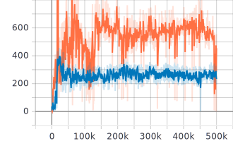
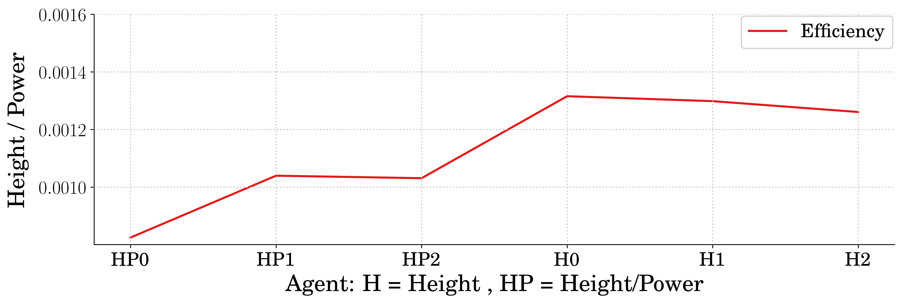

Date: 03/31/2021    
Author: Andrew Albright    
Email: andrew.albright1@louisiana.edu

# Discussion of Key Findings
Using the `pogo_stick_jumping_contAction.py` env, we are seeing some examples of how RL might be coming up with good controllers that seek to minimize power usage. Below is training data where the agent is told to balance power usage with jump height. This graph represents episodic power usage over the course of training for different weights of power usage. Light blue represents caring more about power usage, and dark blue represents caring less about power usage.

 
<strong>Comparing Weights for Power and Jump Height</strong>

However we are running into some issues during training. One of which is the agents sometimes get stuck and don't find a way to overcome the power usage punishment. To remedy this, we have established a rollout period during training (10000 time steps) so the agent has some data to go off of in the beginning of training that is not so deterministic. When doing this we see that there is significantly less variance in the actions taken (therefore less variance in the power used). In the figure below, orange represents an agent trained without a rollout period.

 
<strong>Comparing Power Used Variance When A Rollout Is Used</strong>

# Current Difficulties
## Theoretical/Analytical Difficulties
I am currently working on getting the reward tuned for the `pogo_stick_jumping_contAction.py` environment. I will be changing the way the difference in weights for jump height and power usage and re-training.

> ***JV*** Are you happy with the reward function that you've settled on? 

> ***AA*** I think so. It seems it should work logically. The only concern I have, which I discuss later in this report, is the idea that at the start of an episode, the agent is getting very little reward from jump height. Depending on the jump type, the agent could be getting nothing until it gets off the ground. Getting off the ground requires a good bit of power, so punishing for using power in some cases is disincentivizing using even enough power to get off the ground. This results in behavior where the actuator moves at the slowest possible rate over the course of an episode which ends up terminating after 2 seconds. 

> ***AA*** As a possible solution to this, punishing for using power after the agent gets off the ground is an idea. I can see this leading to slightly less power usage, but not drastically. 

> ***AA*** Another idea I considered, is giving the agent access to omega_x and omega_p so that it can learn when to best optimize these weights. This requires a stipulation that any reward received before the agent leaves the ground must have the reward received from power subtracted from it. Otherwise the agent just learns to weight omega_p and and use basically no power while also not leaving the ground. The results I got from this though are opposite of what I expected and less desirable then just telling the agent to jump high. As if the agent is actually learning less efficient control strategies. Which in a way is not bad, it is just not what we want. I might be able to polarize the idea to generate the results we want. Furthermore, plotting omega_x and omega_p with respect to time is interesting and proof that the reward function is working, though perhaps not like I thought it should. See plot below which is three different agent each trained on three different seeds, H means the agent was seeking to jump high only, HP means the agent was trying to balance power and height.

 
<strong>Height only vs Height and Power letting the agent choose omega_x and omega_p</strong>

## Technical/Implementation Difficulties
### Stable Baselines Framework
I have run into some issues not realizing what the code is doing because I do not thoroughly run through a debugging session to make sure the variables I am updating are acting like I want. I have worked through a lot of these issues and am making progress through them. 

> ***JV*** Good.

# Team Activities
## Running/Jumping Robot Team:
Little progress has been made since the posters were completed. The team members are getting loaded with undergad type work I assume, but we need to get more done if we want to be in a decent position by the time the semester ends.

1. Eve - has worked through some data that I sent her to plot and returned with the proper looking plots after some working through some matplotlib issues. She is working on getting more familiar with the code I have written and will soon be tasked with more complex tasks.

2. Jacob - I do not know what he has been up to. I know he was working on getting the hardware running from the code based on ROS. However I am not sure what kind of progress he has made in the past two weeks. 

3. Logan - Was working on putting together the experimentation documentation for testing the single legged system. I have not seen anything from this in the past week.

4. Myself - working on the training and evaluating agents for the pogo stick environment. Current main focus is on the `pogo_stick_jumping_contAction.py` environment, but I will be shifting some of that focus towards the `pogo_stick_jumping_springAction.py` soon. 

> ***JV*** Do you have regular/standing meetings with them? You might want to set some up. You can say that I pushed for it, given the we're under a time crunch and need to all be on the same page... "The less time you have to complete a project, the better you need to plan and manage it."

> ***AA*** I do not have seperate meetings from the ones that we normally have no. I will set something like that up. 

## Crawfish Peeling Team:
We just water jetted the parts we needed to complete the Cutting subsystem and the new cams for the Clamping subsystem. With this done, the assembly can be completed and testing can begin. 

1. Brennon - Working on a third redesign for the Clamping cams. He is using a method that I think will produce good results this time as well. He is also working on the IMECE paper outline in preparation of writing the paper due 04/23/2021

2. Myself - Evaluated the basic performance of the Meat Removal system. The video was presented last week. It is working as expected, but may need additional considerations. 
    
# Papers
## High Level Reviews
[1] J. Pace, M. Harper, C. Ordonez, N. Gupta, A. Sharma, and E. G. Collins, “Experimental verification of distance and energy optimal motion planning on a skid-steered platform,” Unmanned Syst. Technol. XIX, vol. 10195, p. 1019506, 2017, doi: 10.1117/12.2262921.

[2] M. Harper, J. Pace, N. Gupta, C. Ordonez, and E. G. Collins, “Kinematic modeling of a RHex-type robot using a neural network,” Unmanned Syst. Technol. XIX, vol. 10195, p. 1019507, 2017, doi: 10.1117/12.2262894.

[3] M. Y. Harper, J. V. Nicholson, E. G. Collins, J. Pusey, and J. E. Clark, “Energy efficient navigation for running legged robots,” Proc. - IEEE Int. Conf. Robot. Autom., vol. 2019-May, pp. 6770–6776, 2019, doi: 10.1109/ICRA.2019.8793599.

[4] P. Fankhauser, M. Hutter, C. Gehring, M. Bloesch, M. A. Hoepflinger, and R. Siegwart, “Reinforcement learning of single legged locomotion,” IEEE Int. Conf. Intell. Robot. Syst., pp. 188–193, 2013, doi: 10.1109/IROS.2013.6696352.

[5] Y. Yang, K. Caluwaerts, A. Iscen, T. Zhang, J. Tan, and V. Sindhwani, “Data efficient reinforcement learning for legged robots,” arXiv, no. CoRL, pp. 1–10, 2019.

[6] S. Seok, A. Wang, M. Y. Chuah, D. Otten, J. Lang, and S. Kim, “Design principles for highly efficient quadrupeds and implementation on the MIT Cheetah robot,” in Proceedings - IEEE International Conference on Robotics and Automation, 2013, pp. 3307–3312, doi: 10.1109/ICRA.2013.6631038.

[7] S. Ha, J. Kim, and K. Yamane, “Automated Deep Reinforcement Learning Environment for Hardware of a Modular Legged Robot,” 2018 15th Int. Conf. Ubiquitous Robot. UR 2018, pp. 348–354, 2018, doi: 10.1109/URAI.2018.8442201.

[8] G. Buondonno, J. Carpentier, G. Saurel, N. Mansard, A. De Luca, and J. P. Laumond, “Actuator design of compliant walkers via optimal control,” IEEE Int. Conf. Intell. Robot. Syst., vol. 2017-Septe, pp. 705–711, 2017, doi: 10.1109/IROS.2017.8202228.

[9] T. Ueno, Y. Nakamura, T. Takuma, T. Shibata, K. Hosoda, and S. Ishii, “Fast and stable learning of Quasi-Passive Dynamic Walking by an unstable biped robot based on off-policy natural actor-critic,” IEEE Int. Conf. Intell. Robot. Syst., pp. 5226–5231, 2006, doi: 10.1109/IROS.2006.281663.

[10] J. Ackerman and J. Seipel, “Energy efficiency of legged robot locomotion with elastically suspended loads,” IEEE Trans. Robot., vol. 29, no. 2, pp. 321–330, 2013, doi: 10.1109/TRO.2012.2235698.

[11] X. Da et al., “Learning a contact-adaptive controller for robust, efficient legged locomotion,” arXiv, no. CoRL, 2020.

[12] M. A. Sharbafi, M. J. Yazdanpanah, M. N. Ahmadabadi, and A. Seyfarth, “Parallel compliance design for increasing robustness and efficiency in legged locomotion-proof of concept,” IEEE/ASME Trans. Mechatronics, vol. 24, no. 4, pp. 1541–1552, 2020, doi: 10.1109/TMECH.2019.2917416.

[13] G. Kenneally, A. De, and D. E. Koditschek, “Design Principles for a Family of Direct-Drive Legged Robots,” IEEE Robot. Autom. Lett., vol. 1, no. 2, pp. 900–907, 2016, doi: 10.1109/LRA.2016.2528294.

[14] G. Fadini et al., “Computational design of energy-efficient legged robots : Optimizing for size and actuators To cite this version : HAL Id : hal-02993624 Computational design of energy-efficient legged robots : Optimizing for size and actuators,” 2020.

[15] S. Seok et al., “Design principles for energy-efficient legged locomotion and implementation on the MIT Cheetah robot,” IEEE/ASME Trans. Mechatronics, vol. 20, no. 3, pp. 1117–1129, 2015, doi: 10.1109/TMECH.2014.2339013.

[16] F. Iida and R. Tedrake, “Motor control optimization of compliant one-legged locomotion in rough terrain,” IEEE Int. Conf. Intell. Robot. Syst., pp. 2230–2235, 2007, doi: 10.1109/IROS.2007.4399195.

[17] J. L. Pusey, J. M. Duperret, G. C. Haynes, R. Knopf, and D. E. Koditschek, “Free-standing leaping experiments with a power-autonomous elastic-spined quadruped,” Unmanned Syst. Technol. XV, vol. 8741, p. 87410W, 2013, doi: 10.1117/12.2016073.

[18] G. A. Folkertsma, S. Kim, and S. Stramigioli, “Parallel stiffness in a bounding quadruped with flexible spine,” IEEE Int. Conf. Intell. Robot. Syst., pp. 2210–2215, 2012, doi: 10.1109/IROS.2012.6385870.

These papers represent works that are related to the MECC and IMECE paper. Some of them have been more than just high level, however not high enough to write too much about them. I have notes and annotations in Mendeley for further considerations.

> ***JV*** Good job. Keep trying to get to ~10 of these per week.

## Detailed Reviews
n/a

> ***JV*** I know that we'v been busy, but let's not make a habit of letting these slip.

> ***AA*** Certainly is not a habit, though the consistency is making it look that way I agree. This semester has been a busy one for sure. I will try and make more time to fill these out.

### Cite
### Summary
### Main Contribution to Relationship Field
### Relevance to Current Research

## Future Reading
### Types of papers I plan to read in the next two weeks:
* I will be looking to find more papers which demonstrate RL or ES being used to
  *  develop a control strategy for legged-locomotion system
  *  ... for a non-rigid system
  *  modify the physical parameters of a system (preferably a locomotive one)
* Look into papers related to data-driven control
* sim-to-real papers
* Papers which discuss reward function tuning
* Look into reading Papers which are generally just interesting and not ones that are directly related to my research

### What I am aiming to achieve from reading these papers: 
* I want to read papers which directly relate to the current issues I am having (reward tuning), papers which highlight the overall scope of my work (RL for flexible systems and changing design parameters), papers which are going to be filling me in on some future processes (sim-to-real), and papers which help keep me sane (things I find interesting).

### Why I am looking to achieve that:
* To help solve the issues I am having, to help keep me guided, to help keep me from running into a wall when a new task comes my way, to help keep me sane.

# Plan for the Next Two Weeks 
* Jump height and Power usage data for the pogo system finalized
  * This is the same as last time, however I am finding that finalized is a strange word to try and lock down.
* Agents trained to solve optimal K for the pogo env optimal input from Dr. Vaughans paper
  * No progress has been made on this is the past few weeks and it needs attention
* Paper for MECC finished
  * Due Date: 03/09/2021
* Paper for IMECE more finished
  * Due Date: 03/23/2021

## Ideas Looking Forward

### Crawfish Peeler Project
I am still thinking the design for the Extraction subsystem will need modifying. I think we can utilize much, if not all, of the hardware we have now to accomplish the goal. We are still anticipating testing the current design.

### Robotics Research
I want to test the agents we get from the `pogo_stick_jumping_contAction.py` environment on systems with different spring constants to see how well the agent performs given a different environment. Then I want to train an agent on environment where the spring k is varied during trainging and see how it compares to the other agent. I will need to get a better reward function defined first though.

I want to train some agents with a reward that looks to save power after the pogo stick is off the ground. I have seen some evidence that the agent is prioritizing saving power in certain instances which leads to the pogo stick never leaving the ground. I am thinking a way to train a control strategy then will be to punish the agent for using power once it gets off the ground. Or punish it for using power as a function of height. So the higher the pogo stick is, the less power it should be using.

## Current Next Steps

### Crawfish Peeler Project
Get the Clamping systems cams redesigned and get the motors turning more controlled. 

### Robotics Research
Figure out the Reward function issues for the `pogo_stick_jumping_contAction.py`. Train agents and evaluate performance on the `pogo_stick_jumping_springAction.py` environment. Finish the MECC Paper. Start and continue the IMECE paper.

## Expectations for Next Report (12/02/2020)
1.  Jump height and Power usage data for the pogo system finalized
    - This is the same as last time, however I am finding that finalized is a strange word to try and lock down.
2. Agents trained to solve optimal K for the pogo env optimal input from Dr. Vaughans paper
   - No progress has been made on this is the past few weeks and it needs attention
3. Paper for MECC finished
   - Due Date: 03/09/2021
4. Paper for IMECE more finished
   - Due Date: 03/23/2021

## Current Schedule Outlook
* 04/05 - Crawfish Team Meeting
* 04/07 - Running/Jumping Robot Team Meeting
* 04/07 - Crawfish Team Report Due
* 04/07 - Running/Jumping Robot Team Report Due
* 04/09 - Full Team Meeting
* 04/09 - MECC Paper Due
* 04/12 - Crawfish Team Meeting
* 04/14 - Report Due

# Long-term planning

## Upcoming Paper Deadlines
* 04/09 - MECC Full Paper Due
  * Paper on power consevation
* 04/23 - IMECE Full Paper Due
  * Paper on mechanical design
* 06/07 - ICCAS Full Paper Due
  * Paper topic not determined
* 09/14 - ICRA Full Paper Due
  * Paper topic not determined

## Administrative Deadlines
### Running/Jumping Robots Team
See paper deadlines. Currently the team beyond me is not going to be holding up these deadlines. However, if we want to get them re-writing one of the papers you sent that Yasmine worked on, that is an option.

### Crawfish Peeler Team
See paper deadlines.

### Research
[MS Graduation Process](http://crawlab.org/wiki/index.php?title=MS_Graduation_Process)