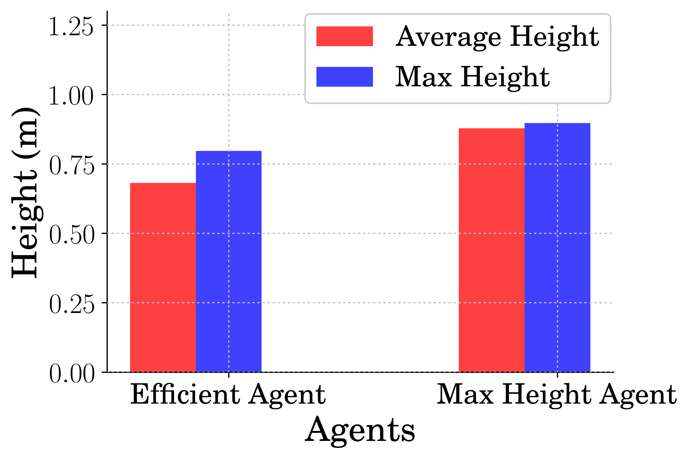
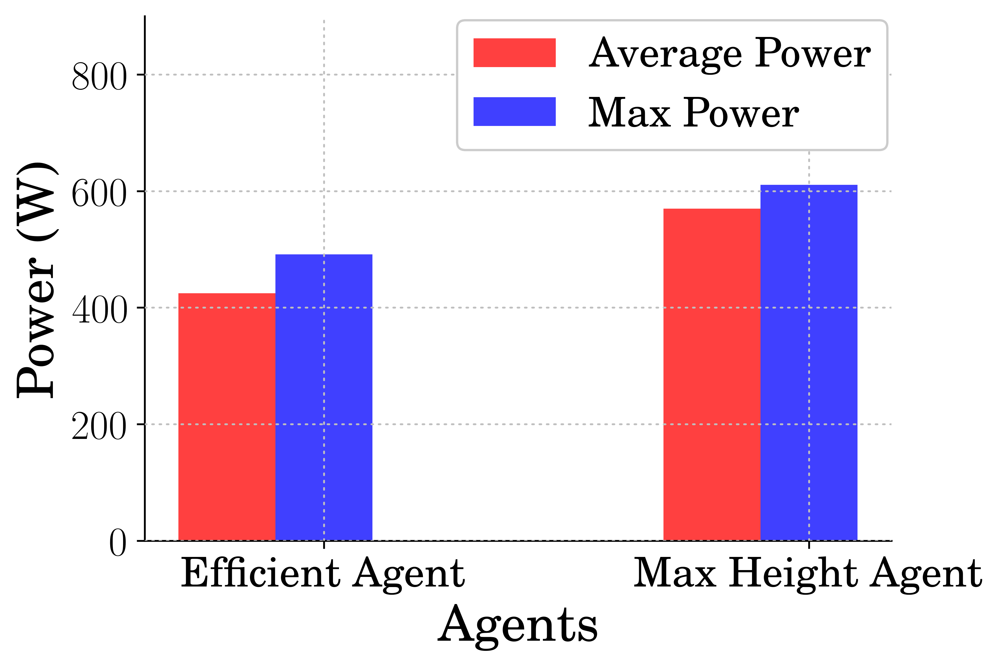
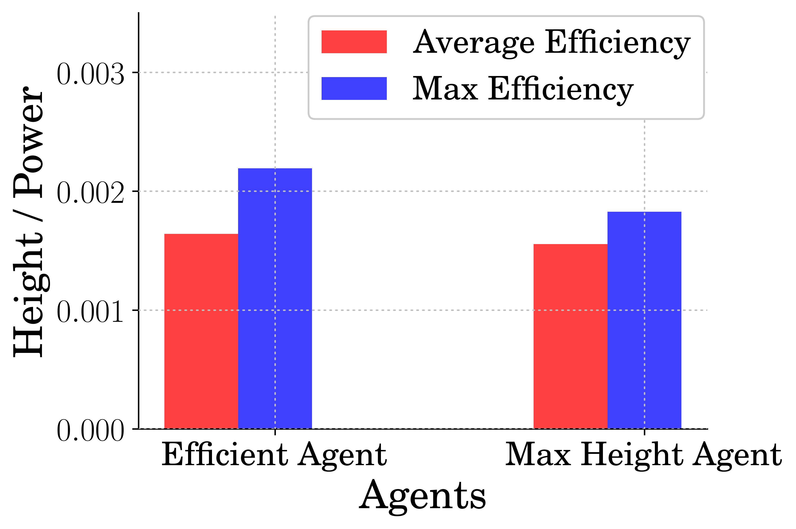

Date: 04/14/2021    
Author: Andrew Albright    
Email: andrew.albright1@louisiana.edu

# Discussion of Key Findings
Using latest data, and the `pogo_stick_jumping_contActionNonlinear.py` file, we have gotten some results which show us that RL is a viable option for designing controllers which are more efficient for flexible jumping systems.

See figures comparing the two different agents. One which seeks only to maximize height and the other which seeks to maximize height while also minimizing power. Five different agents were trained with each strategy, the Max bar represents the best performing agent out of the five trained for each strategy. Average being the average of all five agents. In the case of this training data, one of the Max height agents did not get off the ground, this agent was discarded from this set of data. 

 
<strong>Average and Max Height for Stutter Jump</strong>

 
<strong>Average and Max Power Used for Stutter Jump</strong>

 
<strong>Average and Max Efficiency for Stutter Jump</strong>

# Current Difficulties
## Theoretical/Analytical Difficulties
I had a lot of difficulty getting data to prove that RL can make more efficient models. I was trying to generate data that showed a varying about of efficiency based on the omega values which would be treated as hyperparameters.

## Technical/Implementation Difficulties
### Stable Baselines Framework
I suck at writing python, haha. I write code that I think is doing something and it turns out it is only sort of doing that thing. There are a lot of things to keep track of and things slip through and I don't realize it till later. 

I am mostly okay with this at the moment as I do end up finding these mistakes which makes me a better programmer in the end. However, there are times when I accidentally find problems when trying to write better code for more efficient changes, which I don't like. If I am finding things on accident, not necessarily when evaluating results, that means there could be other mistakes that exist that are effecting results that I do not know exist.

# Team Activities
## Running/Jumping Robot Team:
Even less progress has been made since last time. The undergrads are running out of push. I tried to set up meetings, but no one responded to me getting times to do so. I will push this again.

1. Eve - Anxious for more data. This is mostly on me. I do not have data that I am confident in to send her. I could just send her random data for practice I suppose. However, I do not want to feel like she just needs to keep practicing plotting. That being said, she has taken innitiative and is looking into learning more about the details related to training and evaluating models. Which is great!

2. Jacob - EKIA... I haven't heard from him in a while 

3. Logan - Working on getting the experimental procedure written. I currently have this. It looks okay as it stands actually. We are going back and forth with it to get something that we could give to Eve so she can get some experience with hardware while also testing weather or not it is a good enough procedure.

4. Myself - I am working on the pogo-stick and MECC paper work still. I finally have some data that I think is worth putting down. 

## Crawfish Peeling Team:
Completed early preliminary testing. The De-header works for some of the teeth pretty reliably. The Clamping device is too strong and crushed the tails. The Cutting device is still underway. The Meat Removal device works if the Clamping device works.  

1. Brennon - Working on a rework of the Clamping device. Working on the IMECE paper.

2. Myself - Got all the parts assembled for the Cutting device. Assisting with the redesign of the Clamping device.
    
# Papers
It's officially a habit I suppose. I will get back on this. My reading skills have been slacking. I have read more, some of the papers I read however did not end up in the folder for this report. This also does not include any of the papers you sent over the past few weeks. I read some of them, but not all yet. The ones that I have not are still marked to be read. I value your paper suggestions a lot and read, at least a high level, of every one of them. 

## High Level Reviews

[1] R. Blickhan and R. J. Full, “Similarity in multilegged locomotion: Bouncing like a monopode,” J. Comp. Physiol. A, vol. 173, no. 5, pp. 509–517, 1993, doi: 10.1007/BF00197760.

[2] X. Bin Peng, G. Berseth, and M. Van De Panne, “Terrain-Adaptive Locomotion Skills Using Deep Reinforcement Learning,” vol. 35, no. 4, pp. 1–12, 2016.

[3] F. Iida, G. Gómez, and R. Pfeifer, “Exploiting body dynamics for controlling a running quadruped robot,” 2005 Int. Conf. Adv. Robot. ICAR ’05, Proc., vol. 2005, pp. 229–235, 2005, doi: 10.1109/ICAR.2005.1507417.

[4] D. J. Blackman et al., “Leg design for running and jumping dynamics,” 2017 IEEE Int. Conf. Robot. Biomimetics, ROBIO 2017, vol. 2018-Janua, pp. 2617–2623, 2018, doi: 10.1109/ROBIO.2017.8324814.

[5] M. Ahmadi and M. Buehler, “Stable control of a simulated one-legged running robot with hip and leg compliance,” IEEE Trans. Robot. Autom., vol. 13, no. 1, pp. 96–104, 1997, doi: 10.1109/70.554350.

[6] J. Aguilar, A. Lesov, K. Wiesenfeld, and D. I. Goldman, “Lift-off dynamics in a simple jumping robot,” Phys. Rev. Lett., vol. 109, no. 17, pp. 1–5, 2012, doi: 10.1103/PhysRevLett.109.174301.

[7] H. W. Park, P. M. Wensing, and S. Kim, “High-speed bounding with the MIT Cheetah 2: Control design and experiments,” Int. J. Rob. Res., vol. 36, no. 2, pp. 167–192, 2017, doi: 10.1177/0278364917694244.

[8] U. Saranli, M. Buehler, and D. E. Koditschek, “RHex: A Simple and Highly Mobile Robot,” Int. J. Rob. Res., vol. 20, no. 7, pp. 616–631, 2001.

[9] J. Hurst, “The Role and Implementation of Compliance in Legged Locomotion,” Int. J. Rob. Res., vol. 25, no. 4, p. 110, 2008.. 

## Detailed Reviews
  
### Cite R. Blickhan and R. J. Full, “Similarity in multilegged locomotion: Bouncing like a monopode,” J. Comp. Physiol. A, vol. 173, no. 5, pp. 509–517, 1993, doi: 10.1007/BF00197760.
### Summary
Highlights the usefulness of the pogo-system. Shows how essentially all jumping gates from different animals can be represented using the pogo-stick model.

### Main Contribution to Relationship Field
Explains that use of a pogo stick model for comparing jumping dynamics for many different animals. A pogo like model can be used to "represent approximation[s] of the dynamics used by many legged animals". 

### Relevance to Current Research
I found this useful becuase if this sort of model can be used to represent lots of different jumping gaits for different animals. It is solid proof that it is also a good model to use to represent a control strategies capability for different jumping gaits.

## Future Reading
### Types of papers I plan to read in the next two weeks:
* I should read papers having to do with reward function development since that is what I am spending do much time on lately
* I also will be looking for papers related to previously mentioned items in past reports

### What I am aiming to achieve from reading these papers: 
* I might fill some gaps that I am missing when developing reward functions to do what I want.
 
### Why I am looking to achieve that:
* To prevent me from losing more time (maybe aimlessly) messing with reward functions to do what I want.

# Plan for the Next Two Weeks 
* Paper for MECC finished
  * Due Date: 03/09/2021
* Agents trained to solve optimal K for the pogo env optimal input from Dr. Vaughans paper
  * No progress has been made on this is the past few weeks and it needs attention
* Paper for IMECE more finished
  * Due Date: 03/23/2021

## Ideas Looking Forward

### Crawfish Peeler Project
We are working through some of the issues seen in initial testing. We have come up with some ideas to try and clamp the tail based on essentially clamping the tail by hand and seeing how they react. 

Brennan is getting it modeled up and we are going to get some quick prototype turn arounds.

### Robotics Research
Honestly, just trying to get thus MECC paper written. I am pretty disappointed in my lack of ability to get this thing working and need to get past it so I can move on to bigger and better things.

## Current Next Steps

### Crawfish Peeler Project
Get the Clamps redesigned and back in testing. Get the Cutting system tuned and running. 

### Robotics Research
Get the MECC paper material finished up, get the IMECE paper underway.

## Expectations for Next Report (12/02/2020)
1. Paper for MECC finished
   - Due Date: 03/09/2021
2. Agents trained to solve optimal K for the pogo env optimal input from Dr. Vaughans paper
   - No progress has been made on this is the past few weeks and it needs attention
3. Paper for IMECE more finished
   - Due Date: 03/23/2021

## Current Schedule Outlook
* 04/16 - Full Team Meeting
* 04/16 - MECC Paper Due
* 04/19 - Crawfish Team Meeting
* 04/21 - Crawfish Team Report Due
* 04/21 - Locomotion Team Report Due
* 04/21 - Locomotion Team Meeting
* 04/21 - ENGR 508 Exam 2
* 04/23 - Full Team Meeting
* 04/26 - Crawfish Team Meeting
* 04/28 - Locomotion Team Meeting
* 04/28 - Report Due
* 04/29 - IMECE Paper Due

# Long-term planning

## Upcoming Paper Deadlines
* 04/16 - MECC Full Paper Due
  * Paper on power consevation
* 04/29 - IMECE Full Paper Due
  * Paper on mechanical design
* 06/07 - ICCAS Full Paper Due
  * Paper topic not determined
* 09/14 - ICRA Full Paper Due
  * Paper topic not determined

## Administrative Deadlines
### Running/Jumping Robots Team
See paper deadlines. 

### Crawfish Peeler Team
See paper deadlines.

### Research
[MS Graduation Process](http://crawlab.org/wiki/index.php?title=MS_Graduation_Process)