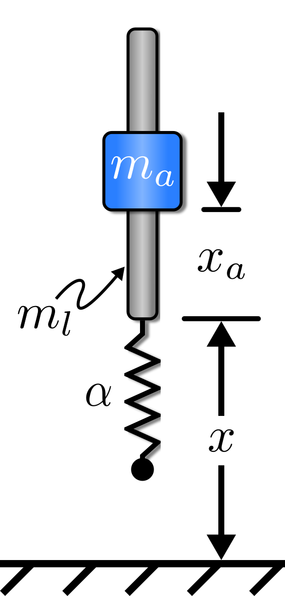
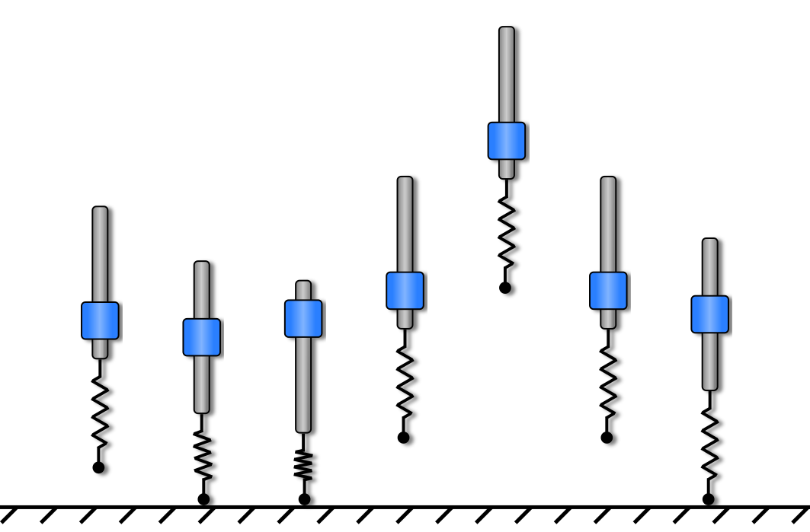

# Evaluating the Optimality of Reinforcement Learning Using Input Shaping
### Authors: Andrew Albright, Joshua Vaughan
### Current Date: 01/25/2022
### Due Date: 11/15/2021 (abstract)

## Abstract
Legged mobile robotic systems are often deployed because of their many advantages over wheeled or tracked systems. They have been shown to be able to traverse more treacherous terrain deploying jumping-like techniques to overcome otherwise not traversable landscapes. It is difficult however to define robust and efficient control strategies for these types of systems using traditional methods however. Using input shaping techniques, it has been shown that optimal jumping strategies can be defined for flexible systems. In this work, input shaping is used to validate if reinforcement learning can find similar optimal jumping techniques using a monopode jumping system.

## Introduction
### Legged Locomotion
Using legged mobile systems as compared to wheeled or tracked systems is often advantageous in terms of system capability. These systems have been used for their ability to navigate harsh, uneven and unpredictable terrain \cite{Park, Blackman, Seok}. Defining control strategies for these systems is challenging however particularly when flexible components are introduced into the morphology. Many techniques exist to define locomotion strategies still, many of which are considered traditional \cite{}. Modern machine learning methods such as reinforcement learning have also shown promise in their ability to define proper control strategies.
### Reinforcement Learning
Reinforcement learning, a form of machine learning, has been shown to be a viable method for defining controllers for many different types of systems \cite{}. In particular, the method has proven useful for learning complex control inputs for robotics systems /cite{}. Though many different types of algorithms have been evaluated, the ones that are most prevalent in regards to the ability to consistently learn without strenuous hypermeter tuning are actor-critic and gradient decent type algorithms. 

The challenge of tuning an algorithm to find control strategies is not negated all together though, particularly when training a robust controller expected to perform with unexpected physical changes to the system. Training utilizing domain randomization has been shown to improve controller performance where system mechanical parameters may experience inaccuracies \cite{}. In addition, this technique has been shown to be useful when performing the simulation-to-real process \cite{}. In this work it is of interest to discover how the utilization of domain randomization changes the controller's output when changing system parameters. 

Of the different algorithms currently considered cutting-edge in research, Twin Delayed Deep Deterministic Policy Gradient (TD3) is one which has shown its ability for robotics control systems \cite{}. This algorithm, being built from the popular Deep Deterministic Policy Gradient (DDPG) \cite{}, and is of the actor-critic type. TD3 was the algorithm of choice and was used to train all the controllers in this work. Details regarding the specifics behind the algorithm and the training parameters are highlighted in the **Appendix**. 
### Input Shaping
Some background information on input shaping. Some words from DVs paper.

## Environment

 
<strong>Monopode System</strong>

|                  Model Parameter                 |    Value   |
|:------------------------------------------------:|:----------:|
|                Mass of Leg, $m_1$                |  0.175 kg  |
|              Mass of Actuator, $m_a$             |  1.003 kg  |
|           Natural Frequency, $\omega_n$          |  11.13 Hz  |
|             Sprint Constant, $\alpha$            |  5760 N/m  |
|          Actuator Stroke, $(x_a)_{max}$          |   0.008m   |
|    Max. Actuator Velocity, $(\dot{x}_a)_{max}$   |   1.0 m/s  |
| Max. Actuator Acceleration, $(\ddot{x}_a)_{max}$ | 10.0 $m/s^2$ |

The monopode system shown in Fig.~\ref{} has been shown to be useful as a base for representing the jumping gaits of many different animals \cite{}. As such, and because jumping robots are often inspired by animal movement, it is used in this work. 

Controlling the system is done so by accelerating the mass of the actuator $m_a$ along the mass of the rod $m_l$. A nonlinear spring with constant $\alpha$ is modeled to represent system flexibility along with a damper (not shown in figure). The variables $x$ and $x_a$ represent the rod's position from zero and the actuator's position along the rod, respectively.

The equations which govern system behavior in simulation are: 
$$  
\ddot{x} = \frac{\gamma}{m_t} \left ( a\,x + \beta \, x^{3} + c\,\dot{x} \right) - \frac{m_a}{m_t}\ddot{x}_a - g
$$

where $\ddot{x}$, $\dot{x}$ and $x$ are the rod's acceleration, velocity and position, respectively; $\ddot{x}$ represents the actuator acceleration and system input. The system's total mass along with the actuator's mass are represented by $m_t$ and $m_a$, respectively. Constants $c$ and $a$ represent the damping ratio and spring constant, and $\beta$ is set to $1e8$. Constant $\gamma$ is in place to prevent the system's spring and damper from acting when the system is not in contact with the ground and can be expressed as:

$$ 
\gamma =
\left\{\begin{matrix}
    -1, & x \leq 0\\ 
    \hphantom{-} 0, & \textup{otherwise}
\end{matrix}\right.
$$

The spring compression limit, or the systems position in the negative $x$ direction, is limited to 0.008m. Additionally, the system is confined to move only vertically in regards to Fig.~\ref{} so that controlling ballance is not required.

## Training Controllers

### Training Environment

 
<strong>Stutter Jump</strong>

One hundred controllers were trained for each case discussed below, each with a different network initialization based on a set of seeds. This was to ensure the methods were reliable and repeatable. The network seeds used in this work can be found in the **Appendix**. The controllers were trained to jump in a manner matching what is seen in Fig.~\ref{}. This type of jump has been called a stutter jump and can be described as the system jumping firstly to gain energy and secondly to gain height.

The state space and action space which the TD3 algorithm was provided was:

$$
\mathcal{S} = \left[ x_{a_t}, \dot{x}_{a_t}, x_t, \dot{x}_t \right]

$$

$$
\mathcal{A} = [\ddot{x}_{a_t}]
$$

where $x_{a_t}$ and $\dot{x}_{a_t}$ are the actuator's position and velocity, respectively, and $x_{t}$ and $\dot{x}_{t}$ are the rod's position and velocity, respectively. $\ddot{x}_{a_t}$ is the actuator's acceleration and the system input. 

- Table of System Initial Position 

At the start of each training episode, the system was initialized according to states provided in Tab.~\ref{}. The rod's position was set accounting for spring compression due to system mass so that the system was at rest. The actuator was initialized randomly along its full length stroke. See Section.~\ref{} and Section.~\ref{} for further details on the mechanical parameters changed during simulation initialization.

A training episode was considered completed if one of two parameters where met. Either the system completed a stutter jump, where the rod's position became greater than zero and then returned to zero twice, or the episode reached the maximum number of steps. In this work, the maximum number of steps was set to 500 which represented a 5 second simulation. 
### Non-Robust
The controllers trained in a non-robust fashion were done so without deploying domain randomization. Therefore the system was initialized with the same set of mechanical parameters for each episode. Those parameters are highlighted in Tab.~\ref{}. The rewards passed to the TD3 algorithm were design to test two learning scenarios: learning to jump as high as possible and learning to jump as high as possible efficiently. The rewards used were:

$$
R_{height} = x_t
$$

$$
R_{efficiency} = \frac{x_t}{\sum P_t}
$$

where, $x_t$ and $P_t$ were the rod's height and the system't power used at each time step, respectively. Power usage in this work was defined mechanically as the product of the actuator's mass, acceleration and velocity. 

- Deploy TD3 (maybe PPO as well) to train agents to
  - Jump to maximum height
  - Jump to specified height
  - Jump to max/specified height efficiently

### Robust
The controllers trained to be able to combat changes in system parameters were trained employing domain randomization. The spring constant, $k$, was randomly initialized at the start of each episode such that the natural frequency of the system could change by $\pm\,30 \%$. Additionally, the damping ratio, $\zeta$, was randomly set between the ranges of $0.00$ and $0.01$, where the expectation was lower $\zeta$ values would lead to better performance both in height and efficiency. The rewards used to train the robust controllers were the same as the non-robust controllers and can be seen in Eq.~\ref{} and Eq.~\ref{}. 

- Deploy TD3 (maybe PPO as well) to train agents to
  - Jump to maximum height
  - Jump to specified height
  - Jump to max/specified height efficiently

### Design Input Shaping Command
How were the commands generated?

- Jump to maximum height
- Jump to specified height
- Jump to specified height efficiently
- Perform different jump types
  - Single jump
  - Stutter jump

## Results
### Controller Trained to be Non-Robust
- Figure: Input of all three methods
- Figure: Jumping Height of all three methods
- Figure: Power usage scatter chart of all three methods
### Controller Trained to be Robust
- Figure: Input of all three methods
- Figure: Jumping Height of all three methods
- Figure: Power usage scatter chart of all three methods

## Conclusion

## Appendix
### Twin Delayed Deep Deterministic Policy Gradient (TD3)

TD3 is an actor-critic, off-policy reinforcement learning algorithm wherein the controller is represented by the actor which is formally know as the policy $\pi_{\phi}$. In the deep learning case, the actor is a neural network. The actor takes actions, $\mathcal{A}$, at each time step during simulation which are the system's inputs. The critic is represented by the estimated expected return of taking action $\mathcal{A}$ in state $\mathcal{S}$ and following the policy $\pi$ from then after. The critic is also a neural network, and it is updated according to the temporal difference error found between a set of twin target networks. These target networks are updated to follow the critic network every defined $n$ updates of the critic network. The hyperameters used for the experiments in this work can be found in Table~\ref{}.

- Table of Hyperparameters 

### Network Initialization Seeds
When training a neural network from scratch, once the network design is defined, the node weights must be initialized. In this work, 100 different controllers were trained each with a different network initialization based on a set of seeds. The seeds are listed in Tab.~\ref{}.

|                   Training Seeds                 |
|:------------------------------------------------:|
|                104, 767,  16, 947, 878, 676, 868, 918, 250, 107, 497, 397,  62, 847, 192, 130, 120, 223, 204, 866, 751, 426, 481, 454, 145, 221, 751, 487, 174,  60, 205, 760, 220, 494, 154, 631, 349, 418, 333, 46, 999, 752, 790,  71, 889, 682, 211, 927, 435, 775                |

