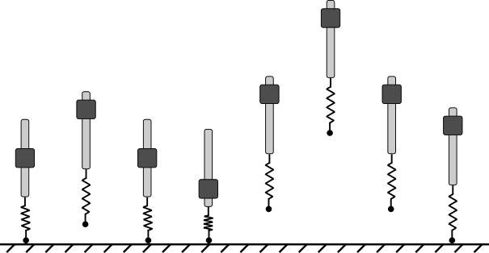

### Authors: Andrew Albright, Joshua Vaughan

### Date: 03/26/2021

### Due Date: 04/09/2021

## Main Takeaway
Reinforcement learning can be used to define control strategies that maximize jumping performance of flexible-legged locomotive type systems. Furthermore, the same strategy can be used to develop controllers which decrease energy usage during jumping, increasing system efficiency.

## Abstract
Legged locomotive systems have many advantages over their wheeled counterparts, such as their ability to navigate rough terrain. They have the ability to deploy many navigating techniques to overcome obstacles, one of which is jumping. Still, there are disadvantages to overcome when using legged systems, such as their lack of energy efficiency. To combat this lack of efficiency, flexible links can be used to conserve energy that would otherwise be wasted during locomotion. Furthermore, control methods can be utilized which assist in both a jumping systems ability to jump high, and their ability to conserve power. Using reinforcement learning (RL) to create these controllers for flexible-legged jumping systems can lead to designs that outperform, in terms of jumping height, traditional optimization methods for jumping. Furthermore, using a power-conservative reward function to train the agent results in a control strategy which balances jump height and energy usage, leading to more efficient jumping control.

## Introduction
* Discussion on the pros and cons of using legged systems for tasks that require locomotion
  * Legged locomotive robots have many advantages over their wheeled counterparts, for example their ability to more easily navigate harshly uneven terrain. \cite{Saranli2001}, \cite{Park2017} \cite{Blackman2018} \cite{Seok2015}. However, there are disadvantages as well, one of which is power consumption. There are several factors that contribute to this disadvantage. For example, in many cases several motors are required to actuate several linkages to move only a few feet, whereas a wheeled system needs only a single motor to turn a wheel to accomplish the same task. Another factor, one that is particularly prevalent when navigating uneven terrain, is the challenge of defining how a walking robot places its feet in such a way that reduces the level of wasted energy by harshly taking steps.

* Discussion on the potential of using flexible links to replace rigid ones to increase performance in terms of accomplishing the goal and in conserving power.
  * In an effort to alleviate the power consumption issues seen when using legged systems to accomplish locomotive tasks such as walking, running and jumping, research has been conducted which replaces rigid aspects of said systems with flexible ones. It has been shown that this not only leads to higher performance but also higher efficiency.  \cite{Sugiyama2004a}, \cite{Galloway2011}, \cite{Hurst2008}, \cite{Seok2015}

* Discussion on using RL for controller design for creating higher jumping robots that also conserve power.
  * While the introduction of flexible components within robotics systems solves some challenges related performance measures like power consumption, it raises other challenges. Particularly the difficulties seen in modeling the the systems become prevalent because the models become highly nonlinear. Different approaches have been taken to circumnavigate and solve these issues. A popular and successful example being the use of series elastic actuators instead of flexible links \cite{Iida2005}, \cite{Ahmadi1997}. Other solutions seek to create control methods which are more suited to non-rigid systems. On of those control methods is the use of reinforcement learning to define control strategies based on interactions with the environment. In this work, RL is used to train an agent (controller) which seeks to jump a simplified jumping robot modeled as a pogo stick. The RL agent is tasked with maximizing jump height while conserving power. It is shown that when tasked as such, the agent finds unique control strategies to maximize the jumping potential of the system, as well as balancing power usage. 

* Road map for the rest of the paper
  * discuss related work in the field
  * detail the method used to test the idea
    * system
    * reward
    * system used to compare (DV's)
  * discuss results 
  * conclude the results and discuss future work

## Related Work
* Reinforcement Learning for Legged Locomotion 
  * Research has shown that using RL for defining control strategies for legged systems is a viable path for simple and even complex legged locomotive systems. \cite{Yang2019} shows that using a model-based method can require an order of magnitude less environment interactions comparing to the best performing model-free algorithms to train controlling agents. However, model-based methods expose other challenges. Learning a model often requires many interactions, and the inevitable limited environment that is learned leads to limited exploration during controller training. As such, model-free methods are often of interest as they can be deployed directly on hardware to learn based on interactions with the environment, or in simulation. \cite{Peng2016} Shows the viability of such an approach training many different agents to locomote navigating uneven terrain. \cite{Reda2020c} shows similar successes using a host of different environments, while also displaying the apparent difficulties of defining an environment.

* Reinforcement Learning for Flexible Systems 
  * As discussed, flexible systems do have some advantages over their rigid counterparts, particularly ones which are used for locomotion tasks. \cite{Thuruthelb} shows the use of model-based methods for controlling soft-robots where as a part of training, learning the model is required. In contrast to that work, \cite{Dwiel2019d} shows that using model-free methods and algorithms such as DDPG \cite{DDPG} prove effective for both locomotive and non-locomotive tasks where flexible systems are considered. Additionally, comparing RL control strategies to more traditional control strategies such as PD control,\cite{He2020f} shows that the comparison results show that RL certainly is practically applicable for controlling flexible systems. Furthermore, work by \cite{Cui2019e} shows that RL can be used for partial control of flexible systems solely to damp out vibration while a separate controller is used to determine general pose.  

* Flexible Robots Improved Performance
  *  ,  \cite{Seok2015}, \cite{Sugiyama2004}, 
  * Using flexible components within robotic systems has shown great potential for conserving power. \cite{Ahmadi1997} shows the results of a common technique which is using flexible joints (series elastic actuators) to increase energy efficiency. \cite{Folkertsma2012} shows that flexible joints are not the only way to increase efficiency, but a similar technique which seeks to emulate the tendons seen in nature can produce similar efficient results. In the work completed by \cite{Seok2015}, \cite{Seok2013}, design principles for efficient quadruped locomotion are discussed, and evidence supports the use of flexible components increases efficiency.
 
* Control for Power Efficiency
*  , \cite{Pace2017}, \cite{Harper2017}
  * In stead of relying solely on the design of a system to increase efficiency, \cite{Harper2019} shows that the use of model predictive control methods can lead to more efficient locomotion strategies alone. 
  * Discussion leading towards talking about using RL for training agents to control flexible legged systems to be more efficient. Which is what we are doing.

## Reinforcement Learning
* Short bit describing RL in the context in which we are using it.
  * Markov Decision Process
  * Actions in an env
  * TD3  

## Pogo-stick Environment
* Define pogo-stick environment
  * A simplified pogo-stick model is used for the environment that the control agents are trained and evaluated on. This environment is used as representation of a generalized flexible legged jumping system. During training, the agent is tasked with learning a control strategy with the input being the acceleration of the mass (m_a) along the rod (m_l). Note that the system is defined in such a way that degrees of freedom are vertical only, so that the agent does not have to learn to balance. 
  * At the start of each training episode, the environment is initialized so that the spring is in contact with the ground and at its initial resting position. The actuator position is randomly initialized along the rod within its min to max position. This is done that the agent can learn a more robust control strategy that allows the system to jump regardless of the initial position of the actuator.
  *  The environment is defined by the OpenAI Gym standard so that frameworks such as Stable Baselines can be used to deploy RL training algorithms like TD3, the algorithm used for this work, and others. The action space is a continuous box type, of one dimension, being the acceleration of the mass (m_a). The observation space is also of the continuous type, but is four dimensional, containing the rods position (x), the rods acceleration (x_dot), the actuators position along the rod (x_a) and the actuators velocity with respect to the rod (x_a_dot). 

  *  Define Training
     *  An episode is defined in three different ways. The first being strictly time based, where the agent is deployed to control the environment to accomplish jumping for a defined amount of time. For our experiments, we used 2 seconds. The second episodic termination stipulation is after the agent completes a single jump. This is defined as the rods position (x) being greater than zero, then returning to zero. The last type of episode termination, is called a stutter jump. This is allowing the rods position to be greater than zero twice and then returning to zero. These three different methods were used to determine RL's effectiveness at attaining high jumping performance control strategies along with power conservative strategies regardless of the type of jumping training received.
     *  All training sessions are halted using a set time step as the stop. Each agent used is trained in its defined environment for a total of 500k time steps. This results in a varying number of episodes, depending on the way the episode is defined to terminate. See Agent Training for more details.

## Reward Function
* Define the reward function used for different training sessions
  * Reward strictly based on jump height
    * The first reward function used is one that seeks to maximize jump height regardless of power used. To accomplish this, the reward function which the RL algorithm will seek to maximize, is defined to match the height reached. The signal returned to the agent is normalized with a predefined maximum height so that if the pogo-stick is ever at or over that maximum, the agent is receiving maximum reward. 
  * Reward based on jump height and power usage
    * The second reward function used is one that seeks to balance jumping height with power consumption during an episode. To do this, the reward signal is split into two individually normalized parts which are also individually weighted with omega_x and omega_p. One part is the reward received for jumping high and is defined identically to the reward used in the other case. The other part is defined in such a way that using more power will result in a lower score. The two individually normalized rewards are then combined utilizing omega_x and omega_p to control how much the agent seeks to conserve power. The two weighted normalized scores are then normalized a final time, so that the reward signal sent back to the RL algorithm is a normalized signal. 

## Results
* Analyze jump height results from agents
* Analyze power consumption results from agents
* Analyse efficiency vs omega_x for power efficiency agents specifically
* Make comparisons of jump height reached to power consumed
* Compare results to DV's paper

## Conclusions
* Using RL leads higher jumping robot control designs
* Using RL also leads to more energy efficient controller designs
* Mention future work giving RL access to the design parameters to further optimize jump height and power consumption

## List of Needed Figures
* Model description figure
* Jumping type visualization figure 
* Table describing the pogo stick's attributes (masses, spring k, etc.)
* Jumping height from DV's paper
* Jumping height from agent which is maximizing jump height
  * Compared to DV's paper
* Jumping height from power saving agent
  * Compared to other agent and DV's paper
* Power consumption from power saving agent
  * Compared to other agent and DV's paper
* Efficiency with respect to omega_x for the power saving agent

 
<strong>Pogo-stick System</strong>

 
<strong>Stutter Jump</strong>

 
<strong>Regular Jump</strong>

